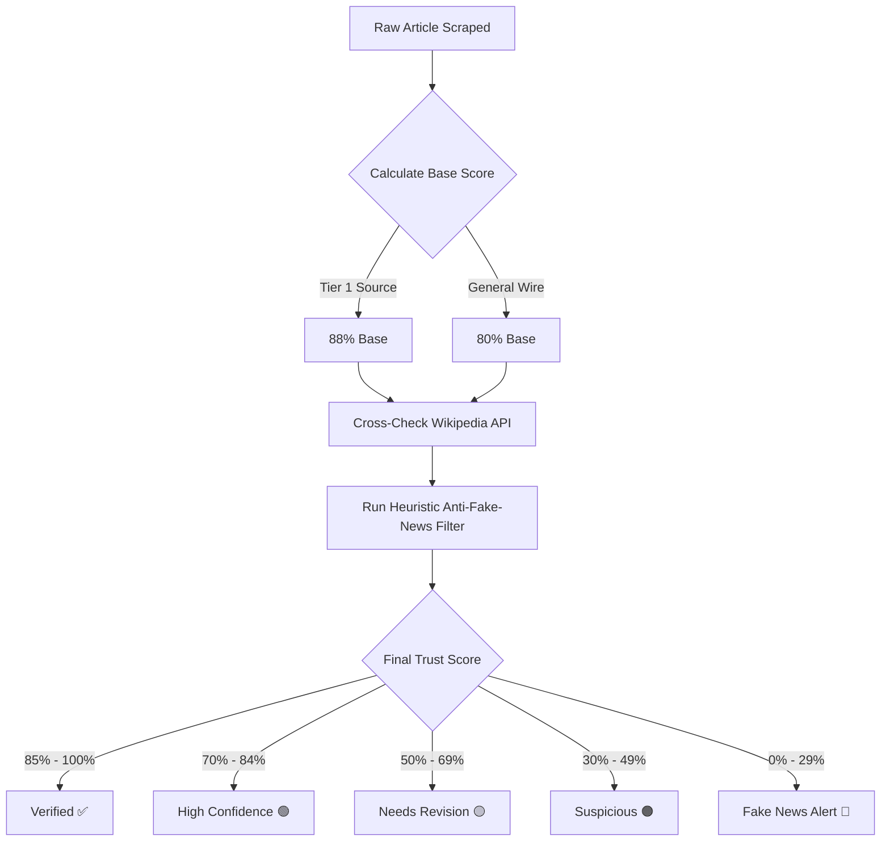

# 🧮 Trust Score Matrix & Fake News Detection Rules

This reference document outlines the exact scoring formulas, weightages, and heuristic rules used by `fact-checking-skill` to assign a **Trust Score (0 - 100%)** to incoming news articles.

---

## 1. Base Score Allocation

Every article begins with a baseline trust score depending on its reported source credibility:

- **Tier-1 Verified Outlets** (Reuters, Bloomberg, FT, BBC, AP, WMO, UN): **88%**
- **General Wire & Standard Media**: **80%**
- **Unverified or Unknown Web Sources**: **65%**

---

## 2. Bonus Factors (Verification Boosts)

| Criterion | Score Change | Condition |
| :--- | :--- | :--- |
| **Wikipedia Entity Match** | `+4%` per entity (Max `+12%`) | Named entity (e.g. "Semiconductor", "Geneva") exists and matches summary on Wikipedia REST API. |
| **FactCheck API Claim Debunk Match** | `+10%` | Claim matches a verified true statement in Google FactCheck API. |
| **Statistical Consistency** | `+5%` | Financial or climate statistics match historical norms ($B range, reasonable % change). |

---

## 3. Penalty Factors (Fake News & Sensationalism Alerts)

| Indicator | Penalty | Description / Trigger |
| :--- | :--- | :--- |
| **Sensationalist / Clickbait Terms** | `-15%` | Title or snippet contains terms like *"shocking"*, *"miracle cure"*, *"secret conspiracy"*, *"100% guaranteed"*. |
| **Excessive Title Capitalization** | `-10%` | Multiple words in ALL-CAPS in headline (e.g. *"SHOCKING BREAKTHROUGH"*). |
| **Anomalous Statistics** | `-20%` | Claimed percentage changes over >500% without official source backing (e.g., *"10000% return"*). |
| **Debunked by FactCheck API** | `-40%` | Claim matched a debasement or "False" verdict in Google FactCheck Claim database. |

---

## 4. Final Rating Classification Matrix

$$\text{Final Trust Score} = \max(5, \min(99, \text{Base Score} + \sum \text{Bonuses} - \sum \text{Penalties}))$$

